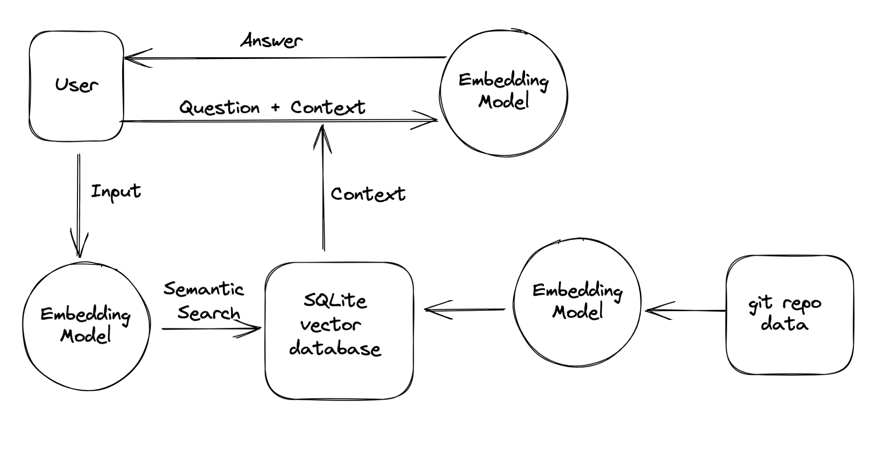

# git-llama

Git Llama provides an offline-first, command line interface to [git source control](https://git-scm.com/) that translates your prompt like:

```sh
git-llama "show me the last 5 commits, just the commit messages"
```

Into the real command:
```sh
git log -5 --pretty=format:%s
```

# Install
Git Llama depends on [ollama](https://github.com/ollama/ollama).
The first iteration of `git-llama` has a decoupled architecture
that doesn't try to install `ollama` for you. If this is a feature
you really want, please
[file a feature request issue](https://github.com/tlehman/git-llama/issues)
and I will write it for you.

# Architecture


# TODO
- [ ] Start `ollama` in background if not already started
- [ ] Add SQLite vector database [sqlite-vec](https://github.com/asg017/sqlite-vec)
- [ ] Write the input -> Embedding Model code
- [ ] Write Semantic Search code
- [ ] Pair every command with it's inverse (if possible) and lots of unit tests
